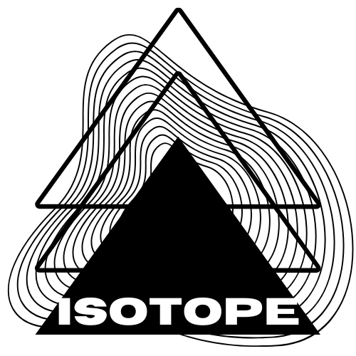
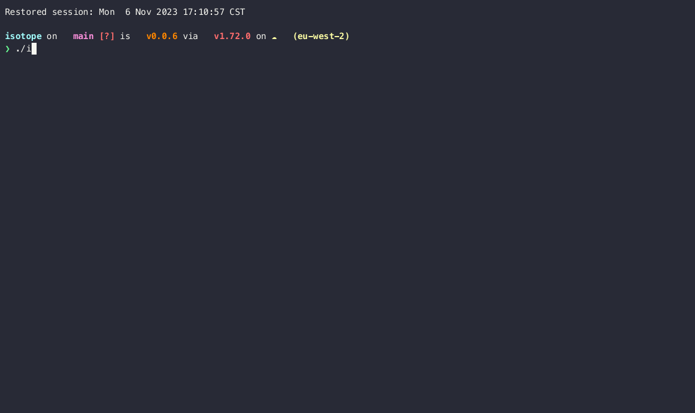

<picture>
  <source media="(prefers-color-scheme: dark)" srcset="./images/logo-dark.png" width="300px;">
  
</picture>
<br/>

# Isotope

Isotope scans AWS services and makes suggestions on how to improve them using AWS Bedrock (Artificial Intelligence).



## Key benefits
- No exfiltration of data beyond your AWS account 
- Discrete examination of your services within AWS
- Simplistic remediation steps designed for humans.


### Example

```
❯ isotope analyze --explain
Current AWS region: eu-west-2
Running STS analyzer
Running S3 analyzer
MFA is not enabled for user alex
 Here are a few ways to enable MFA for a user called 'alex' using the AWS CLI:

1. Enable virtual MFA device:

aws iam create-virtual-mfa-device --virtual-mfa-device-name "alex"

This will create a virtual MFA device for the user. You can then retrieve the seed and QR code to configure the MFA app:

aws iam enable-mfa-device --user-name alex --serial-number arn:aws:iam::123456789012:mfa/alex --authentication-code1 123456


```

## Installation

```
brew install isotope-rs/homebrew-isotope/isotope
```

## Usage

1. Set environment variables for AWS access

```
export AWS_ACCESS_KEY=""
export AWS_SECRET_ACCESS_KEY=""
export AWS_REGION="" ( e.g. eu-west-2 //wherever your VPC is )
export BEDROCK_REGION="eu-central-1"  ( e.g. us-east-1,us-west-2, ap-southeast-1, ap-northeast-1 )
export BEDROCK_MODEL="anthropic.claude-v2" ( e.g. anthropic.claude-v2, anthropic.claude-v1, anthropic.claude-instant-v1 )
```
2. Run all isotope analyzers

```
isotope analyze
```

Optionally for a single analyzer

```
isotope analyze -a S3
```

### Analyzers

- S3
  - Public bucket detection
- STS
  - MFA detection
- RDS
  - Public instance detection
- EBS 
  - Unattached disk 
- SG
  - Permissive security group detection
